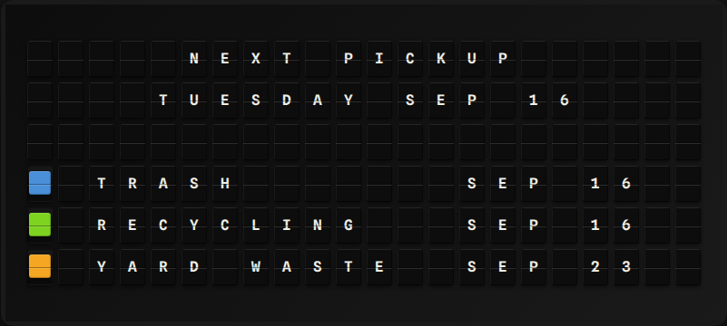

# Trash & Recycling Day Plugin

Show the next trash, recycling, compost or yard-waste pickup from a schedule you describe once.

**→ [Setup Guide](./docs/SETUP.md)** - Configuration instructions

## Overview

The Trash & Recycling Day plugin is purely schedule-driven — there is no API, no account and no key.
You describe up to four collection **streams** (a name, a weekday, weekly or every-other-week), and the
plugin works out the next pickup for each one, plus which streams go out on the next collection day.



It can also take over the board the evening before a collection, so the bins actually make it to the curb.

## Template Variables

### Next pickup

```
{{trash_day.next_date}}      # Sep 16
{{trash_day.next_weekday}}   # Tuesday
{{trash_day.days_until}}     # 3  (0 = today)
{{trash_day.is_today}}       # true / false
{{trash_day.is_tomorrow}}    # true / false (only after the reminder hour)
{{trash_day.next_streams}}   # Trash, Recycling
{{trash_day.message}}        # TRASH + RECYCLING TOMORROW
```

### Per-stream array

Streams are sorted soonest-first, so `streams.0` is always the next pickup.

```
{{trash_day.streams.0.name}}        # Trash
{{trash_day.streams.0.next_date}}   # Sep 16
{{trash_day.streams.0.days_until}}  # 3
{{trash_day.streams.0.color}}       # blue
```

## Example Templates

### Next pickup with a color-coded countdown

```
{center}NEXT PICKUP
{center}{{trash_day.next_weekday}} {{trash_day.next_date}}
{center}{{trash_day.message}}
```

`days_until` ships default color rules (red today, yellow tomorrow, green otherwise), so
`{{trash_day.days_until}}` renders with a matching color tile in front of it.

### One line per stream

```
NEXT PICKUP
{{trash_day.streams.0.name}} {{trash_day.streams.0.next_date}}
{{trash_day.streams.1.name}} {{trash_day.streams.1.next_date}}
{{trash_day.streams.2.name}} {{trash_day.streams.2.next_date}}
```

### Default display

With no template, the plugin renders its own page — a header, the next collection day, then one line
per stream prefixed with that stream's color tile:

```
     NEXT PICKUP
    TUESDAY SEP 16
{blue} TRASH        SEP 16
{green} RECYCLING    SEP 16
{orange} YARD WASTE   SEP 23
```

On a Note (15x3) the weekday is abbreviated and the lines are trimmed to fit.

## Configuration

| Setting | Type | Default | Description |
|---------|------|---------|-------------|
| `streams` | array (max 4) | one weekly Tuesday "Trash" stream | The bins that get collected |
| `streams[].name` | string | — | Short label, e.g. `Trash` (max 12 chars) |
| `streams[].weekday` | enum | `Tuesday` | `Monday`…`Sunday` |
| `streams[].frequency` | enum | `weekly` | `weekly` or `biweekly` |
| `streams[].anchor_date` | string | — | `YYYY-MM-DD` of a known collection day; sets the every-other-week parity. Required for `biweekly`, ignored for `weekly` |
| `streams[].color` | enum | `blue` | `red`, `orange`, `yellow`, `green`, `blue`, `violet`, `white` |
| `timezone` | string | `America/Los_Angeles` | IANA timezone that decides what "today" means |
| `reminder_hour` | integer | `18` | From this hour the evening before, `is_tomorrow` turns on and the takeover fires (0–23) |
| `enable_triggers` | boolean | `false` | Take over the board the evening before a collection |
| `refresh_seconds` | integer | `900` | Recompute interval (minimum 300) |
| `enabled` | boolean | `false` | Enable/disable the plugin |

### Environment Variables

| Variable | Description |
|----------|-------------|
| `TRASH_DAY_ENABLED` | Enable the plugin without using the UI |

## How the schedule is computed

All dates are resolved in the configured timezone, so a board in `America/Los_Angeles` rolls over to the
next day at local midnight rather than at UTC midnight.

- **Weekly** — the next occurrence of the stream's weekday, today included.
- **Biweekly** — the same, then advanced by a week unless it shares parity with `anchor_date`
  (`(candidate - anchor).days % 14 == 0`). The anchor may be in the past or the future; either works.

`validate_config()` rejects unknown weekdays, unknown frequencies and colors, a missing or unparseable
`anchor_date` on a biweekly stream, and an anchor whose weekday doesn't match the stream's.

## Triggers

With `enable_triggers` on, `check_triggers()` fires a board takeover once per collection, starting at
`reminder_hour` the evening before. The trigger id is keyed by the collection date
(`trash_day_2026-09-15`), so the reminder shows once and does not repeat on every poll tick.

## API

None. The plugin computes everything locally from your settings, so there is no key, no rate limit and
no network access.

## Development

```bash
pip install -r requirements-dev.txt
pytest tests/ -v
```

## Author

FiestaBoard Team
